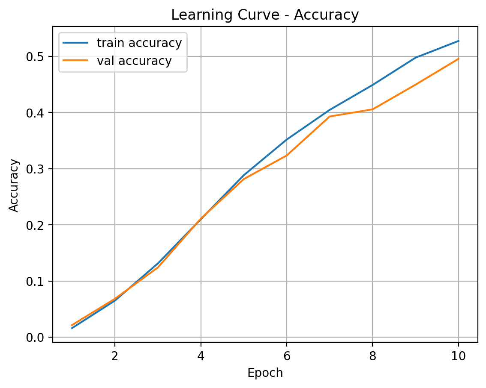
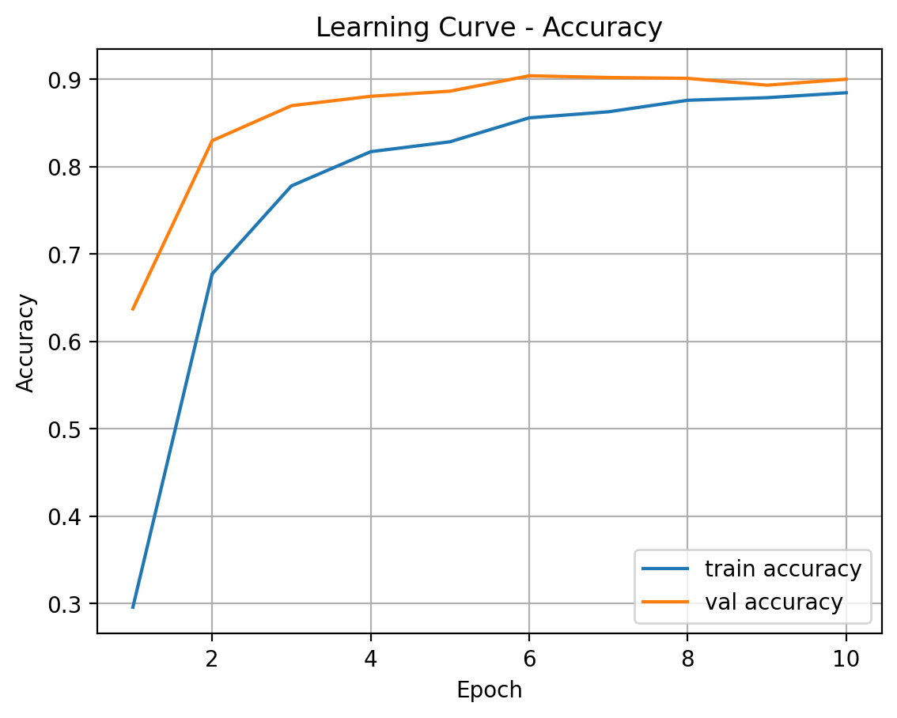
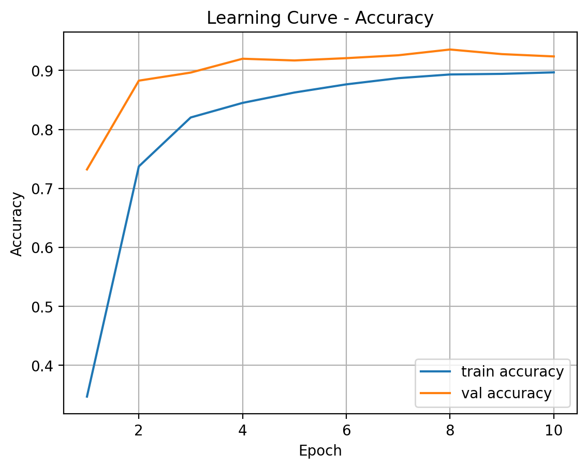
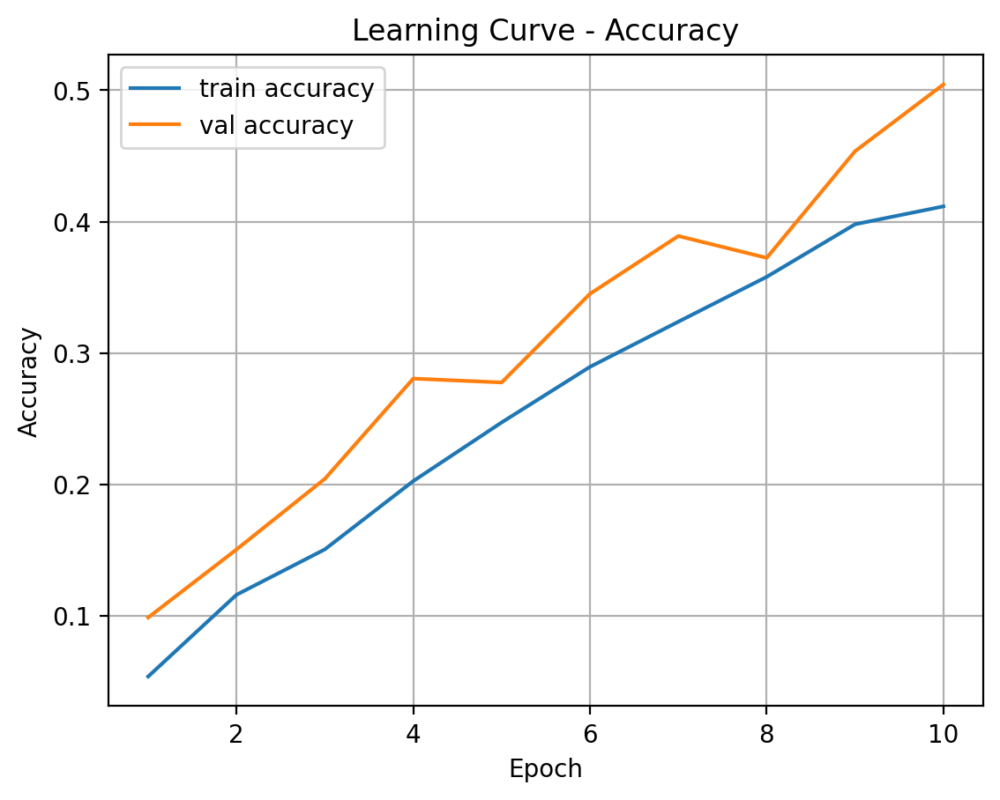

# pokemon-classification

## Experimental Results

# 각각의 모델들은 총 10 epoch를 거쳐 훈련되었으며, batch size=16, lr=0.0001로 설정하였다.

| Experiment | Pretrained | Fine-tuning | Accuracy | Top-5 Accuracy | F1 Score |
|---|---:|---|---:|---:|---:|
| Head Only | Yes | FC only | 0.495 | 0.764 | 0.463 |
| Layer4 | Yes | Layer4 + FC | 0.900 | 0.978 | 0.890 |
| Layer3 + Layer4 | Yes | Layer3 + Layer4 + FC | 0.935 | 0.990 | 0.926 |
| Scratch | No | All layers | 0.504 | 0.803 | 0.468 |

## Learning Curves

### Head Only

### Layer4 + FC

### Layer3 + Layer4 + FC

### Scratch

